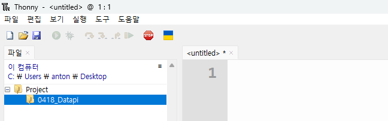

---

marp: true
theme: my-theme 
paginate: true
header: 창의융합인재 프로그램 3기 
footer: 공학도서관 

---

<!--paginate: skip -->
<body>
<h1 style="text-align: center; color: cyan;">공학도서관<h1>
<h2 style="text-align: center; color: white">www.gongdo.kr<h2>
</body>

--- 

###### 창의융합인재 프로그램 3기  

# DataPi  
---

# 목차 
- 복습하기 
- 데이터파이 살펴보기 
- 데이터파이 입력과 출력 
- LED 제어하기
- 버튼 제어하기  
- 네오픽셀 제어하기 
---

<!--paginate: true -->
# 복습하기 
### Thonny의 실행하고 폴더 경로 맞추기 
    1. Thonny 실행

    2. 이 컴퓨터 -> C 드라이브 -> Users -> 사용자명 -> Desktop(더블클릭)  

    3. 새로운 디렉토리 -> 'Project' 폴더 생성 

    4. Project 폴더 안 -> '0418_DataPi' 폴더 생성 

    5. 파일 -> 새 파일  
---
### Thonny의 실행하고 폴더 경로 맞추기 결과


---

# 복습하기 

2. 데이타 파이 보드 연결하기
3. micropython 연결하기 

---

# LED 
- 상태 LED : 초록색
- 네오픽셀 LED : 다양한 색

---
## LED  
: 상태 LED를 깜박이는 코드
```
1. LED 핀 설정
2. 무한 루프
    3. LED 켜기
    4. 0.5초 대기
    5. LED 끄기
    6. 0.5초 대기
```
---

## 무한 루프 (Loop)

```python
while True:             # 조건 
    led.value(1)        # 실행할 내용 
```

---

### 실습
```python
from machine import Pin 
import utime  

led = Pin("LED", Pin.OUT)  

while True:             
    led.value(1)            
    utime.sleep(0.5)     
    led.value(0)         
    utime.sleep(0.5)     
```
---

### 실습 - 2
: LED 의 깜박이는 속도를 조절해보자
```python
from machine import Pin 
import utime  

led = Pin("LED", Pin.OUT)  

while True:             
    led.value(1)            
    utime.sleep(3)     
    led.value(0)         
    utime.sleep(3)     
```
---
## 네오픽셀
: 네오픽셀을 켜고 끄는 의사코드.
```
1. 네오픽셀 핀 설정
2. 네오픽셀 함수 정수
3. 무한 루프
    4. 네오픽셀 켜기
    5. 1초 대기
    6. 네오픽셀 끄기
    7. 1초 대기기
```
---
## 함수 
: 반복해서 실행할 수 있는 재사용 가능한 코드 블록                        
```python
def np_on():                     
    for i in range(0, np0.n):
        np0[i] = (255,0,0)
    np0.write()

def np_off():
    for i in range(0, np0.n):   
        np0[i] = (0,0,0)
    np0.write()

```
---
### 실습
```python
from machine import Pin
import time
from neopixel import NeoPixel

# 네오픽셀 핀 초기화
np0 = NeoPixel(machine.Pin(21), 1)

# 네오픽셀 상태를 추적하는 변수 초기화 
def np_on():
    for i in range(0, np0.n):
        np0[i] = (255,0,0)
    np0.write()
def np_off():
    for i in range(0, np0.n):
        np0[i] = (0,0,0)
    np0.write()

while True:
    # 네오픽셀 켜기
    np_on()
    time.sleep(1)
    # 네오픽셀 끄기
    np_off()
    time.sleep(1)
```

---
### 실습-2
: 네오픽셀의 색상을 변경해보자
```python
from machine import Pin
import time
from neopixel import NeoPixel

# 네오픽셀 핀 초기화
np0 = NeoPixel(machine.Pin(21), 1)

# 네오픽셀 상태를 추적하는 변수 초기화 
def np_on():
    for i in range(0, np0.n):
        np0[i] = (255,0,0)
    np0.write()
def np_off():
    for i in range(0, np0.n):
        np0[i] = (0,0,0)
    np0.write()

while True:
    # 네오픽셀 켜기
    np_on()
    time.sleep(1)
    # 네오픽셀 끄기
    np_off()
    time.sleep(1)
```


---

# 버튼 
- 리셋 버튼 
- 입력버튼

---

### 실습 
1. Blink를 실행한다.
2. 리셋 버튼으로 동작을 멈춘다.  
<!--리셋 버튼 사진-->

---
## 입력버튼 
: 버튼을 누르면 LED가 꺼지고, 버튼을 누르지 않으면 LED가 켜진다. 

```
1. LED 핀 설정
2. 버튼 핀 설정
3. 무한 루프
    4. 버튼의 상태 확인
    5. 버튼이 눌렸을 때
        6. LED 끄기
    7. 버튼이 눌리지 않았을 때
        8. LED 켜기
    9. 0.1초 대기
```

---
## 조건문 
: 첫 번째 줄이 True이면 네 줄로 들여쓰기된 아래 코드를 실행합니다

```python
if button.value() == 0: # 조건
    #참일 때 행동
    led.value(False)
else: 
    #거짓일 때 행동
    led.value(True)
```

---

### 버튼 실습 
```python
from machine import Pin
from utime import sleep
import utime 

led = Pin('LED', Pin.OUT)
button = Pin(20, Pin.IN, Pin.PULL_UP)


while True:
    print(button.value())
    if button.value() == 0:
        led.value(False)
    else:
        led.value(True)
    utime.sleep(0.1)
```
---

# 정리
- 무한 루프 
- 함수
- 조건문  

---
<body>
<h1 style="text-align: center; color: white;">감사합니다.<h1>
<h2 style="text-align: center; color: cyan">공학도서관</h2>
<h2 style="text-align: center;" >www.gongdo.kr<h2>
</body>
