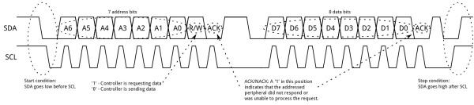
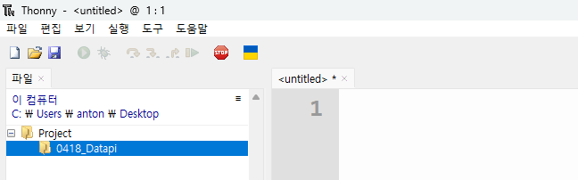

---

marp: true
theme: my-theme 
paginate: true
header: 창의융합인재 프로그램 3기 
footer: 공학도서관 

---

<!--paginate: skip -->
<body>
<h1 style="text-align: center; color: cyan;">공학도서관<h1>
<h2 style="text-align: center; color: white">www.gongdo.kr<h2>
</body>

--- 

###### 창의융합인재 프로그램 3기  

# 데이터를 읽고 쓰기   
---

# 목차 
- 데이터 통신: I2C 
- I2C 실습 
- 조도센서
- 조도센서를 파일에 쓰기


---

<!--paginate: true -->

## 기술 도구를 사용한 읽고 쓰기는 
## 우리에게 어떤 의미인가? 

---

## 사람 간의 언어 vs 기계 간의 언어 

---

# 프로토콜


---

# I2C 


---

# 복습하기 
### Thonny의 실행하고 폴더 경로 맞추기 
    1. Thonny 실행

    2. 이 컴퓨터 -> C 드라이브 -> Users -> 사용자명 -> Desktop(더블클릭)  

    3. 새로운 디렉토리 -> 'Project' 폴더 생성 

    4. Project 폴더 안 -> '0509_DataPi' 폴더 생성 

    5. 파일 -> 새 파일  
---
### Thonny의 실행하고 폴더 경로 맞추기 결과


---

# 복습하기 

2. 데이타 파이 보드 연결하기
3. micropython 연결하기 

---


### I2C 실습 -1 
```python 
from machine import Pin
from machine import I2C
```
---
### I2C 실습 -2 
```python
sdaPIN = Pin(4) 
sclPIN = Pin(5) 

i2c = I2C(0, sda=sdaPIN, scl=sclPIN) 
devices = i2c.scan() 
```
---

### I2C 실습 -3 
```python

if len(devices) == 0:
    print("No I2C device")
else:
    print("I2C device found :", len(devices))

for device in devices:
    print(" Hexa address: ", hex(device))
```

---

### I2C 실습 -완료 
```python
from machine import Pin
from machine import I2C

sdaPIN = Pin(4) 
sclPIN = Pin(5) 

i2c = I2C(0, sda=sdaPIN, scl=sclPIN) 
devices = i2c.scan() 

if len(devices) == 0:
    print("No I2C device")
else:
    print("I2C device found :", len(devices))

for device in devices:
    print(" Hexa address: ", hex(device))
```

---

# 통신하기
## 조도센서 


---
# 준비
1. bh1750 라이브러리 [다운로드](https://github.com/AntonSangho/Dreamscometrue_Lecture/blob/main/lib/bh1750.py) 
2. Rasberry pi Pico에 lib 폴더 만들기 
3. bh1750.py 파일을 업로드 하기 

---

### 조도센서 실습 -1   
```python
from machine import Pin, I2C
from utime import sleep
from bh1750 import BH1750
```

---

### 조도센서 실습 -2   
```python

i2c0_sda = Pin(4)
i2c0_scl = Pin(5)
i2c0 = I2C(0, sda=i2c0_sda, scl=i2c0_scl)

bh1750 = BH1750(0x23, i2c0)
```

---

### 조도센서 실습 -3   
```python
while True:
    print(bh1750.measurement)
    sleep(1)
```

---

### 조도센서 실습 -완료  
```python
from machine import Pin, I2C
from utime import sleep

from bh1750 import BH1750

i2c0_sda = Pin(4)
i2c0_scl = Pin(5)
i2c0 = I2C(0, sda=i2c0_sda, scl=i2c0_scl)

bh1750 = BH1750(0x23, i2c0)

while True:
    print(bh1750.measurement)
    sleep(1)
```

---

# 통신하기 
## RTC 

---

# 준비
1. DS3231 라이브러리 [다운로드](https://github.com/AntonSangho/Dreamscometrue_Lecture/blob/main/lib/ds3231_port.py) 
2. Rasberry pi Pico에 lib 폴더에 업로드하기 
3. ds3231_port.py 파일을 업로드 하기 

---
### RTC 통신하기 -1 
```python
import network
from machine import RTC
from machine import Pin 
from machine import I2C
import utime as time
import usocket as socket
import ustruct as struct
from ds3231_port import DS3231
```
- 라이브러리 가져오기 

---
### RTC 통신하기 -2
```python
rtc = RTC()  

sdaPIN = Pin(4) 
sclPIN = Pin(5) 

i2c = I2C(0, sda=sdaPIN, scl=sclPIN) 

ds3231 = DS3231(i2c) 
```
- RTC와 I2C 통신하기
---
### RTC 통신하기 -3
```python
#ds3231.save_time()  # Set DS3231 from RTC
print('DS3231 time:', ds3231.get_time())
print('RTC time:   ', time.localtime())
```
- RTC 모듈의 시간정보를 동시화시키고 확인하는 코드
---

# RTC 통신하기 -완료 
```python
import network
from machine import RTC
from machine import Pin 
from machine import I2C
import utime as time
import usocket as socket
import ustruct as struct
from ds3231_port import DS3231

rtc = RTC()  

sdaPIN = Pin(4) 
sclPIN = Pin(5) 

i2c = I2C(0, sda=sdaPIN, scl=sclPIN) 

ds3231 = DS3231(i2c) 

# DS3231와 RTC 시간의 차이를 확인하고 싶으면 아래 주석을 하고 실행
#ds3231.save_time()  # Set DS3231 from RTC
print('DS3231 time:', ds3231.get_time())
print('RTC time:   ', time.localtime())

```
---

# RTC 시간을 
# 인터넷으로 동기화

---

### [코드다운로드](https://github.com/AntonSangho/Dreamscometrue_Lecture/blob/main/src/0508/RTC_Sync.py) 

---

### 시간 동기화 -1 
```python
import network
from simpletest.mywifi import networksetting

ssid, password = networksetting()

NTP_HOST = 'pool.ntp.org'
```
---

### 시간 동기화 -완료
```python

import network
from simpletest.mywifi import networksetting
from machine import RTC
from machine import Pin 
from machine import I2C
import utime as time
import usocket as socket
import ustruct as struct
from ds3231_port import DS3231


ssid, password = networksetting()

# wintertime / Summerzeit
#GMT_OFFSET = 3600 * 1 # 3600 = 1 h (wintertime)
#GMT_OFFSET = 3600 * 2 # 3600 = 1 h (summertime)
GMT_OFFSET = 3600 * 9 # 3600 = 1 h (KST)

# NTP-Host
NTP_HOST = 'pool.ntp.org'

# Funktion: get time from NTP Server
def getTimeNTP():
    NTP_DELTA = 2208988800
    NTP_QUERY = bytearray(48)
    NTP_QUERY[0] = 0x1B
    addr = socket.getaddrinfo(NTP_HOST, 123)[0][-1]
    s = socket.socket(socket.AF_INET, socket.SOCK_DGRAM)
    try:
        s.settimeout(1)
        res = s.sendto(NTP_QUERY, addr)
        msg = s.recv(48)
    finally:
        s.close()
    ntp_time = struct.unpack("!I", msg[40:44])[0]
    return time.gmtime(ntp_time - NTP_DELTA + GMT_OFFSET)

# Funktion: copy time to PI pico´s RTC
def setTimeRTC():
    tm = getTimeNTP()
    rtc.datetime((tm[0], tm[1], tm[2], tm[6] + 1, tm[3], tm[4], tm[5], 0))
    

  
wlan = network.WLAN(network.STA_IF)
wlan.active(True)
wlan.connect(ssid, password)
    
max_wait = 10
print('Waiting for connection')
while max_wait > 10:
    if wlan.status() < 0 or wlan.status() >= 3:
        break
    max_wait -= 1    
    sleep(1)
status = None
if wlan.status() != 3:
    raise RuntimeError('Connections failed')
else:
    status = wlan.ifconfig()
    print('connection to', ssid,'succesfull established!', sep=' ')
    print('IP-adress: ' + status[0])
ipAddress = status[0]


rtc = RTC()  

# Set Time 
setTimeRTC()

# Print current time 
print()
print(rtc.datetime())

# Connect to DS3231
print ('Syncing with DS3231')
sdaPIN = Pin(4) # SDA pin
sclPIN = Pin(5) # SCL pin
i2c = I2C(0, sda=sdaPIN, scl=sclPIN) # Init I2C using pins sda and scl

ds3231 = DS3231(i2c) # Create DS3231 object

print('Initial values')
print('DS3231 time:', ds3231.get_time())
print('RTC time:   ', time.localtime())

print('Setting DS3231 from RTC')
# DS3231와 RTC 시간의 차이를 확인하고 싶으면 아래 주석을 하고 실행
ds3231.save_time()  # Set DS3231 from RTC
print('DS3231 time:', ds3231.get_time())
print('RTC time:   ', time.localtime())

# D3231와 RTC 시간의 차이를 확인하고 싶으면 아래 주석을 해제하고 실행
#print('Running RTC test for 2 mins')
#print('RTC leads DS3231 by', ds3231.rtc_test(120, True), 'ppm')

```


---

# 파일 쓰기
## 조도센서   

---
### 파일 쓰기 실습 -1 
```python
from time import sleep
from machine import I2C, Pin
from bh1750 import BH1750
```
- 라이브러리 가져오기 

---
### 파일 쓰기 실습 -2 
```python
led = Pin("LED", Pin.OUT)

sdaPIN = Pin(4)
sclPIN = Pin(5)

i2c = I2C(0, sda=sdaPIN, scl=sclPIN) 

bh1750 = BH1750(0x23, i2c)

def writeLine(text):
    file = open("log.txt", "a")
    file.write(text + "\n")
    file.close()
```
- I2C 연결 
- 쓰기 함수 
---

### 파일 쓰기 실습 -3 
```python
while True:
    light = bh1750.measurement     
    print(light)
    writeLine(str(light))
    led.value(1)
    sleep(0.5)
    led.value(0)
    sleep(0.5)
    #sleep(1800) # 30 minutes
```
- 조도센서 값을 반복해서 쓰기
---

### 파일 쓰기 실습 -완료 
```python
from time import sleep
from machine import I2C, Pin
from bh1750 import BH1750

led = Pin("LED", Pin.OUT)

sdaPIN = Pin(4)
sclPIN = Pin(5)

i2c = I2C(0, sda=sdaPIN, scl=sclPIN) 

bh1750 = BH1750(0x23, i2c)


def writeLine(text):
    file = open("log.txt", "a")
    file.write(text + "\n")
    file.close()
 
while True:
    light = bh1750.measurement     
    print(light)
    writeLine(str(light))
    led.value(1)
    sleep(0.5)
    led.value(0)
    sleep(0.5)
    #sleep(1800) # 30 minutes
```

---

# 정리 
- 통신하기
- 데이터 읽어오기
- 데이터 쓰기 

---
<body>
<h1 style="text-align: center; color: white;">감사합니다.<h1>
<h2 style="text-align: center; color: cyan">공학도서관</h2>
<h2 style="text-align: center;" >www.gongdo.kr<h2>
</body>
