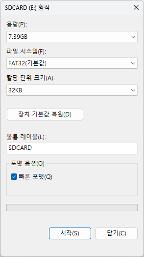

---

marp: true
theme: my-theme 
paginate: true
header: 창의융합인재 프로그램 3기 
footer: 공학도서관 

---


###### 창의융합인재 프로그램 3기  

# 환경데이터 수집하기 
---

# 목차 
- SD 카드 준비하기 
- 코드분석하기 
- 코드 동작 시키기 


---

<!--paginate: true -->


# 준비
1. 컴퓨터에서 SD card 폴더 이름 확인 
2. SD카드 포멧시키기 

---
## SD카드 포멧시키기 


---

# 동작 이해하기  

---
## 코드 다운로드 

---

## [Github](https://github.com/AntonSangho/DataPi_Beekeeping/blob/production/src/main_v0_3.py)

---

## [sdcard 라이브러리](https://github.com/AntonSangho/Dreamscometrue_Lecture/blob/4th/lib/sdcard.py) 

---

# 상태표시
#### 네오픽셀
- 녹색 : 녹화 준비상태
- 파란색 : 녹화 시작
- 노란색: 녹화 종료   
#### LED 
- 점등: 녹화중인 상태 
- 소등: 녹화중이 아닌 상태  
---

# 라이브러리

---
```python
import utime
from machine import Pin, I2C, PWM, ADC
from ds3231_port import DS3231
import onewire, ds18x20
from neopixel import NeoPixel
import uos 
import sdcard
```

---

# 상태 변수

---

```python
sensing_active = False
recording_active = False
recording_interval = 1800  # 데이터 기록 간격을 초 단위로 설정 (예: 30분마다 데이터 기록)
file = None # 파일 객체 초기화
```

---

# 함수

---
```python
def np_red():
    for i in range(0, np0.n):
        np0[i] = (64,0,0)
    np0.write()
def np_green():
    for i in range(0, np0.n):
        np0[i] = (0,64,0)
    np0.write()
def np_blue():
    for i in range(0, np0.n):
        np0[i] = (0,0,64) # blue with 25% brightness
    np0.write()
def np_yellow():
    for i in range(0, np0.n):
        np0[i] = (64,64,0) # yellow with 25% brightness
    np0.write()
def np_off():
    for i in range(0, np0.n):
        np0[i] = (0,0,0)
    np0.write()
```
---

# 버튼 제어

---
```python
def button_handler(pin):
    global recording_active, file
    if pin.value() == 0:  # 버튼이 눌렸을 때
        recording_active = not recording_active
        if recording_active:
            print("recording start")
            Led.value(1)
            np_blue()
            button_buzzer(2000)
            utime.sleep(0.1)
            np_off()
            file = open('/SDCARD/01.csv', 'a') #실제로는 sd카드에 01.csv 파일로 저장
            #file = open('01.csv', 'a') #테스트용으로 피코에 01.csv 파일로 저장
        else:
            print("recording stop")
            np_yellow()
            button_buzzer(2000)
            utime.sleep(0.1)
            np_off()
            if file:
                Led.value(0)
                file.close()
                np_off()
                utime.sleep(1)
                np_green()
```
---

```python
button.irq(trigger=Pin.IRQ_FALLING | Pin.IRQ_RISING, handler=button_handler)
```

---

# 파일 기록 

---
```python
def record_data():
    global file
    # 베터리 전압을 읽어서 data_line에 저장
    batt_adc_value = batt_adc.read_u16()
    batt_voltage = batt_adc_value * 3.3 / 65535 * VOLTAGE_DROP_FACTOR
    for rom in roms:
        temp_sensor.convert_temp()
        utime.sleep_ms(100)
        t = temp_sensor.read_temp(rom)
        dateTime = ds3231.get_time()
        timestamp = "{:04d}-{:02d}-{:02d} {:02d}:{:02d}:{:02d}".format(dateTime[0], dateTime[1], dateTime[2], dateTime[3], dateTime[4], dateTime[5])
        data_line = "{}, {:6.2f}, {:6.2f}\n".format(timestamp, t, batt_voltage)
        #print(t)
        if file:
            file.write(data_line)
```

---

# 반복문 

---

```python
while True:
    if recording_active:
        record_data()
        utime.sleep(recording_interval)  # 사용자가 설정한 기록 간격에 따라 대기
    else:
        Led.value(0)
```

---


---
<body>
<h1 style="text-align: center; color: white;">감사합니다.<h1>
<h2 style="text-align: center; color: cyan">공학도서관</h2>
<h2 style="text-align: center;" >www.gongdo.kr<h2>
</body>
