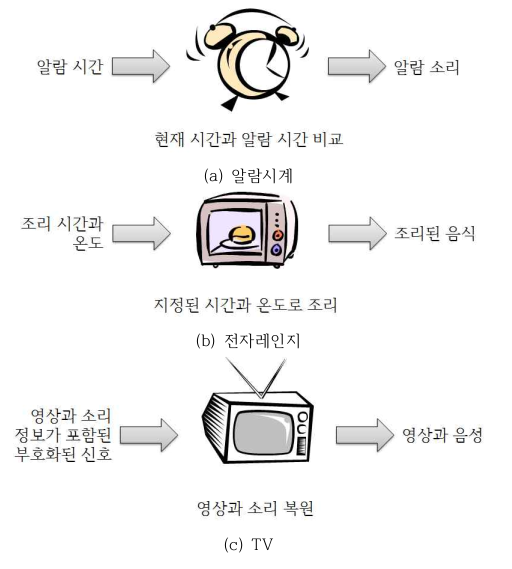
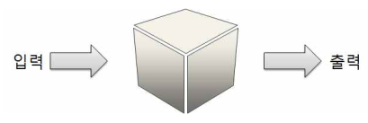
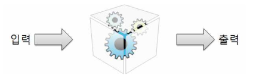
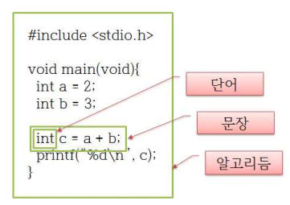
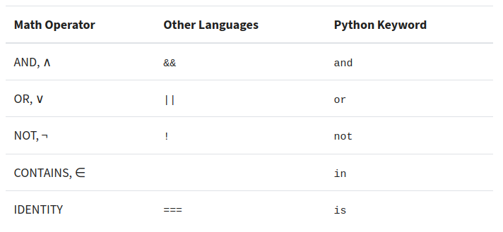
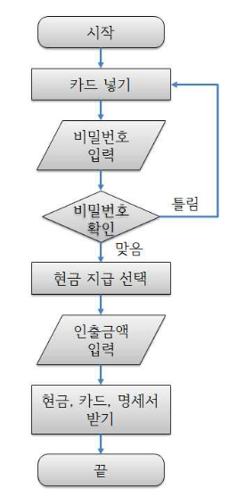
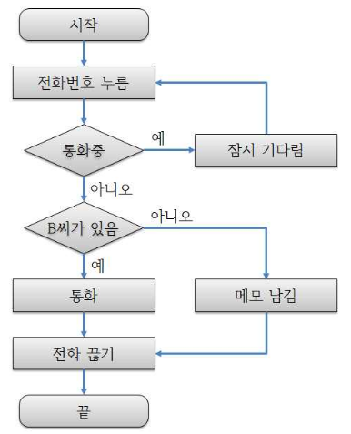

---

marp: true
theme: default
paginate: true
#header: 피지컬 컴퓨팅 입문 
#footer: 해성여고 
---
<!--paginate: skip -->

###### 창의융합인재 프로그램 3기  

# 피지컬 컴퓨팅 입문 

---

# 목차 
- 피지컬 컴퓨핑 입문 
- 피지컬 컴퓨팅 실습 

---
<!--paginate: true -->

###### 이론 
# 피지컬 컴퓨팅 입문  

--- 
# 프로그램으로 무엇을 할 수 있을까?

---

# 시스템 (systēma)
* 공통된 **목적**을 수행하기 위해 조직화된 요소들의 **집합체**  

###### 출처: [위키피디아](https://ko.wikipedia.org/wiki/%EC%8B%9C%EC%8A%A4%ED%85%9C) 
---

# 일상 생활에서의 시스템 
* 아침이면 알람소리를 듣고 일어나고, 일어나서는 전자레인지에 우유와 빵을 데워 아침을 먹고, 잠시 TV를 보다 출근을 한다. 

---



---



---

# 블랙박스
### : 일반 사용자들이 이해하는 입력 출력 그리고 입출력 사이의 관계로 설명되는 시스템
<!--
자세한 내부를 보여주지 않으며 단지 입력과 출력 사이의 관계를 추상적이고 기능 적으로 설명해줄 뿐
-->
* 에어컨
* 아이폰 
* 전자레인지 


---



---

# 화이트 박스

### : 처리 과정을 관찰하고 필요에 따라 변경할 수 있는 시스템 
* 아두이노, 라즈베리파이 
* 3D 프린터  
* 컴퓨터 (리눅스)

---

# 프로그램은 
## 디지털 데이터를 입력 받고 디지털 데이터를 출력하는 모든 시스템에서 상상할 수 있는 모든 처리를 가능하게 해주 는 것.

---

# 프로그램  = 알고리즘 + 프로그래밍 언어
# 한국어 = 문법 + 단어 
---


---
# python 키워드 
```python
False      await      else       import     pass
None       break      except     in         raise
True       class      finally    is         return
and        continue   for        lambda     try
as         def        from       nonlocal   while
assert     del        global     not        with
async      elif       if         or         yield
```
###### 출처: [realpython](https://realpython.com/python-keywords/) 
---


---
# 알고리즘 예시 -1 
### 현금인출기
1. 카드를 넣는다.
2. 비밀번호 4자리를 입력한다.
3. 만약 비밀번호가 틀렸다면 1번부터 다시 시작한다.
4. 서비스 항목 중에서 현금 지급을 선택한다.
5. 액수 3만원이라고 입력한다.
6. 현금과 카드, 그리고 명세표를 받는다.

---

# 알고리즘 예시 -2 
### A씨가 B씨에게 전화를 걸어 내일 만날 약속 장소를 전달하는 일 
1. B씨의 전화를 건다. 
2. 통화 중이면 전화를 끊고 1로 돌아간다. 
3. 전화가 연결되면 B씨를 찾는다. 
4. B씨가 전화를 받았으면 장소를 말하고 6으로 간다. 
5. B씨가 부재중이면 B씨에게 전달할 내용을 메모로 남긴다. 
6. 전화를 끝낸다.

---



---



---
# 기계어 
```
0011000000000
0010100010100
1010101010101
1010101010100
```

---
# 고급 언어 
```python
print('Hello, world!')
```
---
# 컴퓨터에게 말거는 법
- 컴퓨터가 알아 들을 수 있는 단어를 이용해서 컴퓨터가 이해 할 수 있는 문장을 구성하여 명령을 내리기 
- 복잡한 명령을 내리기 위해서는 여러개의 문장이 필요하며 문장들은 시스템의 목적에 맞게 구성 

---
# 알고리즘을 학습하는 과정은? 
* 컴퓨터의 **문제 해결 방식**과 **절차**를 배우는 것

---
# 사람의 말을 알아들을 수 있는 컴퓨터가 있다면? 

---

# 프로그래밍 언어와 사람의 언어의 차이 
* 사람의 언어 : 항상 문법에 맞게 진행되지는 **않는다**는 점이다. 
* 프로그래밍 언어 : 항상 문법에 **맞게 사용**되어야 한다. 

--- 

# 피지컬 컴퓨팅 실습

---

# ping 시트
# https://bit.ly/441vATO 

---

# 코드 저장소 
# https://bit.ly/49z6Xiq

---

# 데이터 파이 키트 구성품 
- 데이타파이: PCB + 라즈베리파이 피코 
- micro-USB 케이블 
- 코인베터리
- AA 베터리 2개
- AA 베터리 케이스

---

# 실습 
- Thonney IDE 설치
- python 실습
- micropython 설치  
- micropython 실습 

---

# 정리
- 프로그램으로 무엇을 할 수 있을까? 
